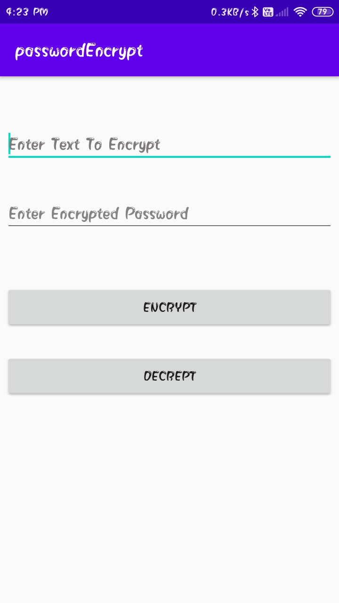
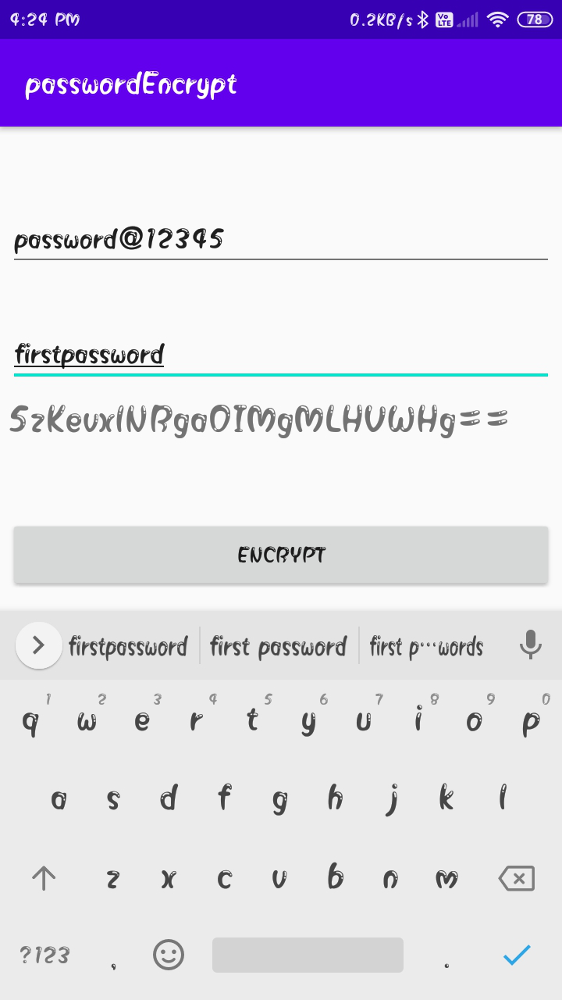
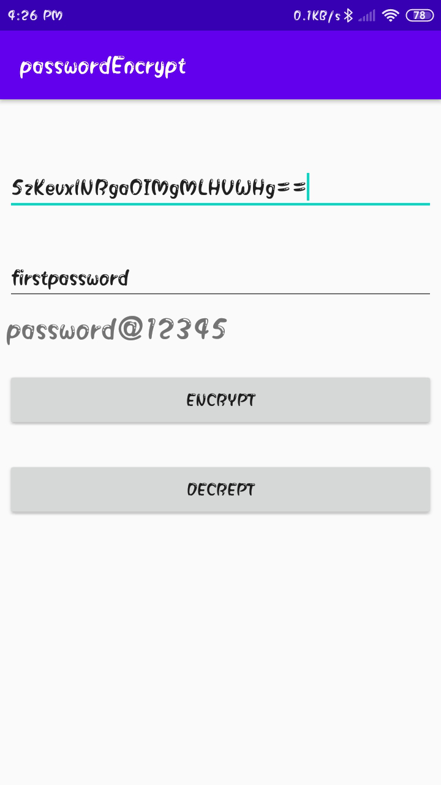

# Password_EncryptionAndDecryption
Password based Encryption / Decryption on Android with AES Algorithm

## Advanced Encryption Standard 

The more popular and widely adopted symmetric encryption algorithm likely to be encountered nowadays is the Advanced Encryption Standard (AES). 
##### It is found at least six time faster than triple DES.

A replacement for DES was needed as its key size was too small. With increasing computing power, it was considered vulnerable against exhaustive key search attack. Triple DES was designed to overcome this drawback but it was found slow.

The features of AES are as follows −

->Symmetric key symmetric block cipher 
->128-bit data, 128/192/256-bit keys 
->Stronger and faster than Triple-DES 
->Provide full specification and design details 
->Software implementable in C and Java 

 

 

 
